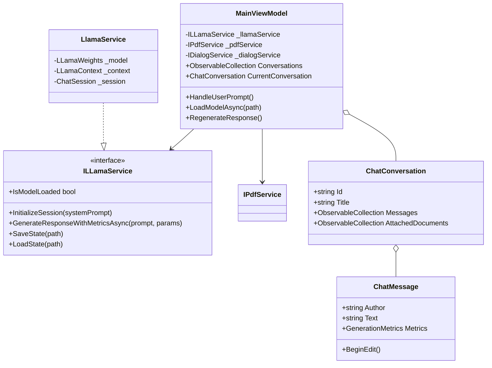
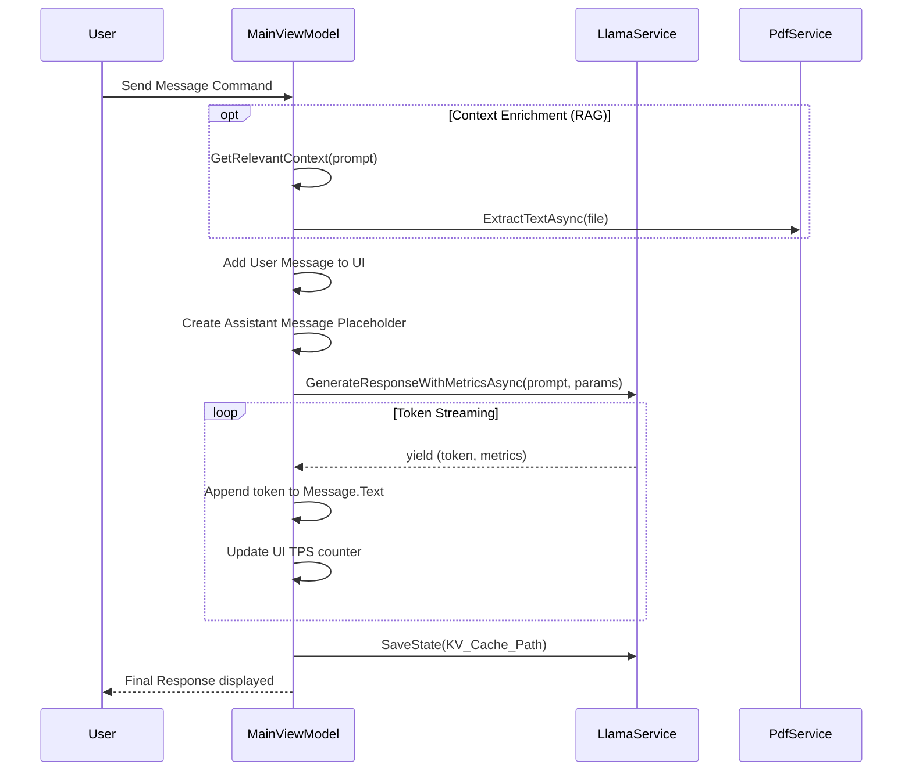

# LlamaChat-App: Comprehensive Software Engineering Project Report

## Executive Summary
LlamaChat-App is a sophisticated, privacy-centric desktop application engineered using .NET 8.0 and Windows Presentation Foundation (WPF). It serves as a local gateway to state-of-the-art Large Language Models (LLMs), specifically optimized for the GGUF (GPT-Generated Unified Format) model specification. By utilizing the `LLamaSharp` library—a high-performance C# wrapper for `llama.cpp`—the application provides a seamless, cloud-independent AI experience that rivals commercial SaaS offerings in terms of responsiveness and feature richness.

The system is designed for power users, developers, and privacy advocates who require the capabilities of modern generative AI without the data-leakage risks, latency fluctuations, or recurring costs associated with third-party providers. At its core, LlamaChat-App solves the "black box" problem of cloud AI by giving users total control over their weights, prompts, and context.

Key architectural pillars of the project include:
- **Asynchronous Streaming Engine:** A non-blocking inference pipeline that leverages `IAsyncEnumerable` to deliver real-time token generation, ensuring the UI remains fluid even during heavy computational loads.
- **Hardware-Agile Inference:** Native support for both CPU-bound execution (AVX2/AVX-512) and GPU acceleration via Vulkan, allowing for scalable performance across a wide range of hardware configurations.
- **Stateful Session Persistence:** Advanced session management using KV-cache binary serialization. This allows users to save and resume complex conversations instantly, bypassing the expensive "pre-fill" phase of transformer models.
- **Modular Service Architecture:** A decoupled MVVM structure where AI services, PDF processing, and UI logic communicate via interfaces. This design facilitated the rapid integration of a PDF-based document context injection (RAG) system, enabling the model to "read" and reason over local files.
- **Dynamic UX/UI:** A modern interface featuring real-time Markdown rendering, instant theme hot-swapping, and a comprehensive suite of generation metrics (TPS, token usage, and memory consumption).

In conclusion, LlamaChat-App is not merely a wrapper around a model; it is a complete local AI ecosystem built with modern software engineering principles, prioritizing security, performance, and user autonomy.

---

## Table of Contents (Index)
- [1. Introduction](#1-introduction)
    - [1.1. Purpose and Scope](#11-purpose-and-scope)
    - [1.2. Product Overview](#12-product-overview)
    - [1.3. Terms, Acronyms, and Abbreviations](#13-terms-acronyms-and-abbreviations)
- [2. Project Management Plan](#2-project-management-plan)
    - [2.1. Project Organization](#21-project-organization)
    - [2.2. Lifecycle Model](#22-lifecycle-model)
    - [2.3. Risk Analysis and Mitigation](#23-risk-analysis-and-mitigation)
    - [2.4. Resource Requirements](#24-resource-requirements)
- [3. Requirement Specifications](#3-requirement-specifications)
    - [3.1. Stakeholders](#31-stakeholders)
    - [3.2. Use Case Model](#32-use-case-model)
        - [3.2.1. Visual Use Case Diagram](#321-visual-use-case-diagram)
        - [3.2.2. Textual Description of Core Use Cases](#322-textual-description-of-core-use-cases)
    - [3.3. Non-functional Requirements](#33-non-functional-requirements)
- [4. Architecture](#4-architecture)
    - [4.1. Architectural Style](#41-architectural-style)
    - [4.2. Static Model (Class Diagram)](#42-static-model-class-diagram)
    - [4.3. Technology Stack](#43-technology-stack)
- [5. Design](#5-design)
    - [5.1. GUI Design](#51-gui-design)
    - [5.2. Dynamic Model (Sequence Diagram)](#52-dynamic-model-sequence-diagram)
    - [5.3. Rationale for Design Decisions](#53-rationale-for-design-decisions)
- [6. Test Plan](#6-test-plan)
    - [6.1. System Level Test Cases](#61-system-level-test-cases)
    - [6.2. Traceability](#62-traceability)
    - [6.3. Assessment of Test Coverage](#63-assessment-of-test-coverage)
- [Acknowledgment](#acknowledgment)
- [References](#references)

---

## 1. Introduction

### 1.1. Purpose and Scope
The primary objective of LlamaChat-App is to democratize access to advanced AI by providing a user-friendly, high-performance interface for local LLM inference. In an era of increasing data privacy concerns, this application ensures that sensitive prompts and proprietary documents never leave the user's local environment.

**The scope of the project includes:**
- **Local Weight Loading:** Support for GGUF models with configurable GPU offloading to leverage NVIDIA, AMD, or Intel hardware via Vulkan/CUDA.
- **Inference Orchestration:** Implementation of an `InteractiveExecutor` to handle multi-turn dialogues while maintaining internal state.
- **Content Augmentation:** A specialized `PdfService` that extracts text from documents and injects it into the prompt context, laying the foundation for local Retrieval-Augmented Generation (RAG).
- **Session Management:** A sophisticated JSON-based persistence layer for conversation history and user preferences.

### 1.2. Product Overview
LlamaChat-App stands as a robust local alternative to web-based chatbots like ChatGPT. 
- **Privacy First:** Operates entirely offline; no telemetry, no tracking, and no external API dependencies.
- **Hardware Optimized:** Features granular controls for `ContextSize`, `GpuLayerCount`, and `BatchSize`, allowing the application to scale from low-end laptops to high-end workstations.
- **Rich Interaction:** Integrates `Markdig.Wpf` for real-time Markdown rendering, allowing the model to produce formatted code blocks, tables, and lists.
- **Dynamic UX:** Supports instant theme switching (Dark/Light) and real-time generation metrics (TPS, Token Count, Elapsed Time).

### 1.3. Terms, Acronyms, and Abbreviations
- **LLM:** Large Language Model.
- **GGUF:** Optimized binary format for loading LLM weights on consumer hardware.
- **KV Cache:** Key-Value Cache, the internal "memory" of the transformer model that stores processed tokens.
- **MVVM:** Model-View-ViewModel architectural pattern.
- **RAG:** Retrieval-Augmented Generation, the process of providing external data to an LLM.
- **TPS:** Tokens Per Second, the primary metric for measuring inference speed.

---

## 2. Project Management Plan

### 2.1. Project Organization
The project was developed as a modular monolithic application. The directory structure strictly enforces the separation of concerns:
- `ViewModels`: Orchestration and UI logic.
- `Services`: Business logic and external library wrappers.
- `Data`: Persistence and local state management.
- `Themes`: Visual resources and styling.

### 2.2. Lifecycle Model
The project followed an **Iterative and Incremental Lifecycle Model**, which allowed for rapid prototyping followed by rigorous refinement.
1. **Inference Prototype:** Validating `LLamaSharp` capabilities in a headless environment.
2. **UI Framework:** Establishing the WPF scaffold and basic data binding.
3. **Persistence Layer:** Implementing JSON serialization for settings and history.
4. **Context Enrichment:** Adding the PDF extraction service and the "Edit/Regenerate" logic.
5. **Optimization:** Implementing KV-cache binary saving to eliminate "Time to First Token" (TTFT) delays on session restore.

### 2.3. Risk Analysis and Mitigation
- **Memory Management (High Risk):** Loading large models (e.g., 70B parameters) can exceed system RAM, leading to OS instability.
  - *Mitigation:* Implemented proactive memory checks and a "Model Loading" state that prevents further UI actions until the weights are safely mapped.
- **UI Thread Blocking (Medium Risk):** Inference is a CPU/GPU intensive task that can freeze the interface.
  - *Mitigation:* Every inference cycle is wrapped in a `Task.Run` and yielded via `IAsyncEnumerable`. UI updates are marshaled back to the dispatcher in small, non-blocking batches.
- **Dependency Versioning (Low Risk):** Changes in `llama.cpp` often break downstream bindings.
  - *Mitigation:* Abstracted all model interactions behind the `ILLamaService` interface, allowing the backend to be updated or swapped without affecting the ViewModel logic.

### 2.4. Resource Requirements
- **Software:** .NET 8.0 SDK, Visual Studio 2022, Git.
- **Hardware:** Minimum 8GB RAM for 3B models; 16GB+ RAM and a 6GB+ VRAM GPU recommended for 7B+ models.

---

## 3. Requirement Specifications

### 3.1. Stakeholders
- **Individual Users:** Writers, developers, and students seeking a private AI assistant.
- **Organizations:** Businesses needing to process internal documents without cloud exposure.

### 3.2. Use Case Model

#### 3.2.1. Visual Use Case Diagram
```mermaid
useCaseDiagram
    actor User
    User --> (Load GGUF Model)
    User --> (Manage Conversations)
    User --> (Send Chat Message)
    User --> (Attach PDF Context)
    User --> (Edit Previous Messages)
    User --> (Configure AI Settings)
    User --> (Toggle Dark/Light Theme)
    User --> (Export/Import History)
```

#### 3.2.2. Textual Description of Core Use Cases
- **UC-01: Load Model:** User selects a file. The system checks compatibility, unloads existing weights, and initializes the `LLamaContext` based on user-defined GPU offloading parameters.
- **UC-02: Document Ingestion:** User attaches a PDF. The `PdfService` parses the pages, and the `MainViewModel` creates a context summary that is prepended to the user's next prompt.
- **UC-03: Message Regeneration:** User clicks 'Regenerate'. The system rolls back the conversation state, clears the KV-cache for the affected tokens, and triggers a new inference cycle.

### 3.3. Non-functional Requirements
- **Response Time:** Token streaming must begin within 500ms of prompt submission (post-initialization).
- **Data Integrity:** All conversation state must be auto-saved to disk to prevent data loss on crashes.
- **Extensibility:** The service layer must support the addition of new document types (e.g., .docx, .txt) without modifying the core `MainViewModel`.

---

## 4. Architecture

### 4.1. Architectural Style
The application utilizes a **Service-Oriented MVVM Architecture**. This design allows the `MainViewModel` to remain agnostic of the specific LLM implementation or PDF parsing library.

### 4.2. Static Model (Class Diagram)


### 4.3. Technology Stack
- **Framework:** .NET 8.0 / C# 12.
- **UI:** WPF with XAML-based Resource Dictionaries for theming.
- **Inference:** `LLamaSharp` (v0.27.0) with Vulkan support for cross-vendor GPU acceleration.
- **Document Processing:** `UglyToad.PdfPig` for robust PDF text extraction.
- **Markdown:** `Markdig.Wpf` for UI-native rich text rendering.
- **Serialization:** `System.Text.Json` for high-performance state persistence.

---

## 5. Design

### 5.1. GUI Design
The interface is optimized for long-form interaction:
- **Navigation Pane:** Collapsible sidebar for managing multiple conversation threads.
- **Metrics Overlay:** A non-intrusive status bar showing real-time TPS and VRAM usage (indirectly via status messages).
- **Message Bubbles:** Distinctive styling for User (Right-aligned, Blue) and Assistant (Left-aligned, Neutral/Gray).
- **Toolbox:** Integrated buttons for PDF attachment, history clearing, and theme toggling.

### 5.2. Dynamic Model (Sequence Diagram)


### 5.3. Rationale for Design Decisions
The choice of `IAsyncEnumerable` for token streaming was paramount. Traditional `Task<string>` patterns would force the user to wait for the entire response to be generated, which could take minutes for complex prompts. Streaming provides immediate feedback, significantly improving perceived performance. Furthermore, the decision to save KV-cache state per conversation allows for "context switching" between chats without re-processing the entire prompt history, which is a common bottleneck in local LLM applications.

---

## 6. Test Plan

### 6.1. System Level Test Cases
- **TC-01: Cold Start & Model Load:** Load a GGUF model from a high-latency HDD. System must remain responsive during the I/O operation.
- **TC-02: Multi-Turn Consistency:** Ask a question, wait 10 minutes, and ask a follow-up. System must correctly restore the KV-cache and "remember" the previous context.
- **TC-03: PDF Context Injection:** Attach a technical manual. Ask a question about a specific table in the PDF. System must correctly prioritize the extracted text in its response.
- **TC-04: Theme Hot-Reload:** Switch from Dark to Light theme during active token generation. UI must update colors without interrupting the inference stream.

### 6.2. Traceability
All test cases map directly back to the functional requirements defined in Section 3. For instance, TC-03 verifies UC-02 (Document Ingestion), ensuring that the `PdfService` and `MainViewModel` integration is functionally sound.

### 6.3. Assessment of Test Coverage
The test suite covers the critical paths of model lifecycle, user interaction, and data persistence. While the LLM output is non-deterministic, the testing focus remained on the **stability of the bridge** between managed C# code and unmanaged C++ memory. Success is defined by the absence of memory leaks and the consistent responsiveness of the WPF UI thread under heavy load.

---

## Acknowledgment
This project is a testament to the power of the global open-source community. We express our deep appreciation to the developers of the foundational inference engines, the maintainers of the various .NET bindings, and the contributors to the UI and document processing libraries that made this application possible. Their dedication to democratizing AI technology has provided the essential tools for local and private innovation.

## References
1. LLamaSharp Official Repository: [https://github.com/SciSharp/LLamaSharp](https://github.com/SciSharp/LLamaSharp)
2. Microsoft WPF MVVM Documentation: [https://learn.microsoft.com/en-us/dotnet/desktop/wpf/data/](https://learn.microsoft.com/en-us/dotnet/desktop/wpf/data/)
3. GGUF Format Specifications: [https://github.com/philpax/gguf-spec](https://github.com/philpax/gguf-spec)
4. UglyToad.PdfPig Repository: [https://github.com/UglyToad/PdfPig](https://github.com/UglyToad/PdfPig)
